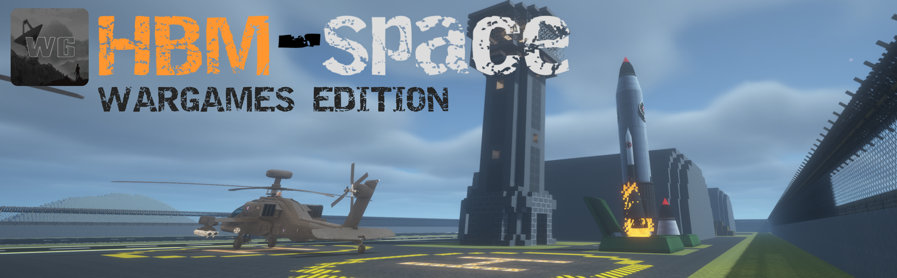

<!-- Wargames Development Group README.
     Keep HBM-README.md as the preserved upstream HBM Space README. -->

[](https://www.patreon.com/c/WargamesDevelopment)
[](https://discord.wargames.uk)

# HBM-Space Wargames Edition

HBM-Space Wargames Edition is the Wargames Development Group fork of
[HBM-Space](https://github.com/JameH2/Hbm-s-Nuclear-Tech-GIT) by
[James-H2](https://github.com/JameH2), which itself extends
[HBM's Nuclear Tech Mod](https://github.com/HbmMods/Hbm-s-Nuclear-Tech-GIT).

The fork keeps the HBM-Space content base while adding the multiplayer,
territory, faction, orbital-warfare and server-safety integration required by
the Wargames ecosystem.

For the preserved upstream HBM-Space README, see [HBM-README.md](HBM-README.md).



## What is different in Wargames Edition?

Wargames Edition is no longer only a set of protection hooks around HBM.
It now contains a full integration layer between HBM-Space and WGCore,
including orbital station ownership, faction-authorized station travel,
Breach attacks, protected objectives, persistent cleanup and server-safe
recovery.

The fork is still intended to remain recognisably HBM-Space. WDG changes are
primarily focused on multiplayer behaviour, integration, administration and
orbital conflict rather than replacing HBM's normal progression.

For standard HBM gameplay, items and progression, refer to the
[official Nuclear Tech Mod wiki](https://nucleartech.wiki/) and the upstream
HBM-Space project.

---

## WDG Features

### WGCore integration

HBM-Space Wargames Edition contains an HBM-facing WGCore integration layer for
territory, factions, protection and orbital conflict.

When WGCore is installed, HBM can use WGCore decisions for:

- player and faction targeting;
- block and chunk targeting;
- detonation and explosion damage;
- radiation and contamination;
- faction ownership and territory;
- orbital station ownership;
- Orbital Breach state and authorization;
- station hacking, evacuation and settlement.

The integration is designed so that HBM-Space can still retain standalone
behaviour when WGCore is absent.

### Protection and territory handling

WDG systems route supported HBM actions through territory-aware checks instead
of allowing high-impact systems to bypass protected areas.

This includes:

- explosion and block-damage filtering;
- protected-chunk handling;
- player-damage authorization;
- radiation restrictions;
- contamination restrictions;
- detonation and target validation;
- protection-aware launch and impact behaviour.

Explosion filtering can preserve permitted parts of an affected area instead of
requiring every explosion to behave as a simple all-or-nothing cancellation.

### Ownership and attribution

WDG integration preserves ownership and faction context through the HBM systems
that need it for multiplayer authorization.

This is used by systems such as:

- launchers and rockets;
- missiles and explosive payloads;
- automated or remotely initiated attacks;
- faction-aware targeting;
- orbital station travel and Breach operations.

The goal is to avoid anonymous high-impact actions where WGCore needs to know
who initiated them and whether that action is permitted.

---

## Orbital Stations and Breach Warfare

The WDG fork substantially extends the multiplayer side of HBM-Space orbital
stations.

### Station Drive Terminal

The **Station Drive Terminal** is the player-facing workflow for station and
Breach drive programming.

It supports the WDG station-drive lifecycle, including:

- permanent faction Orbital Station Drives;
- WGCore-managed Breach Drives;
- drive cloning and reprogramming;
- authorization checks before launch;
- expired Breach Drive handling;
- clear launch-preflight feedback.

The old player-facing `/ntm station create` and `/ntm station raid` workflows
have been retired in favour of the Station Drive Terminal. Administrative
station listing, deletion and recovery commands remain available where
appropriate.

### Faction-owned orbital stations

Permanent orbital stations can be associated with stable WGCore station
identity and faction ownership.

The integration keeps station identity and generation data synchronized so that
travel, cleanup and Breach state are not accidentally applied to an obsolete or
replaced station.

If WGCore rejects a newly generated station registration, the generated station
is cleaned up instead of leaving an unowned or inconsistent orbital cell.

### Breach Drives and launch authorization

Breach Drives are tied to WGCore's active orbital-conflict state.

The HBM side enforces:

- faction authorization for station and Breach drives;
- Breach-target validity before launch;
- Breach Drive expiry when an assault ends;
- rejection of unavailable, stale or evacuated targets;
- launcher and rocket checks without unrelated inventory-slot corruption;
- safe abort/return behaviour when a destination becomes invalid.

### Temporary Breach outposts

Successful Breach deployment can create temporary orbital outposts registered
with WGCore.

These outposts:

- use WGCore-controlled Breach entitlement;
- are registered as temporary orbital territory;
- are removed when the associated Breach lifecycle ends;
- use persisted cleanup so interrupted server sessions can recover safely.

### Station Computer hacking

The registered **Orbital Station Computer** is the Breach objective.

During an active Breach:

- the exact registered computer is used as the hacking target;
- WGCore owns the authoritative hack state and countdown;
- HBM synchronizes the active hack state to the client;
- the Station Computer overlay shows Breach progress;
- a visible boundary marks the required hacking area;
- the tracked objective cannot simply be broken, moved or destroyed to evade
  the attack.

Outside the relevant Breach phases, normal HBM Station Computer behaviour is
preserved.

### Victory, evacuation and cleanup

Orbital Breach closeout is coordinated between HBM and WGCore rather than
immediately deleting station terrain.

The current lifecycle includes:

- evacuation windows after a successful Breach;
- prevention of new travel into a station being evacuated;
- safe handling of defenders and attackers after failed assaults;
- persistence of player station/outpost identity across logout;
- recovery of players who log back in after their station or outpost was
  removed;
- restart-safe station and outpost cleanup;
- reusable station names after defeated cells are retired;
- settlement confirmation before destructive station-cell cleanup;
- recovery of interrupted cleanup after server restart.

HBM also preserves landing-pod and forced-return safety during orbital
evacuation and invalid-destination handling.

---

## Launch, missile and weapon integration

### Launch systems

Launchers and rideable rockets participate in WDG authorization instead of
blindly accepting every programmed drive or target.

The integration covers:

- station-drive authorization;
- Breach-drive authorization;
- invalid-target preflight checks;
- launch-origin tracking;
- safe surface return handling;
- compatibility with normal launch-pad inventory behaviour.

### Missile and projectile behaviour

The WDG fork retains the multiplayer-oriented missile and projectile work
developed for the server, including protection-aware impacts and ownership
propagation where supported.

Existing WDG behaviour includes work around:

- bunker-buster / penetration behaviour;
- airburst behaviour;
- cluster and multi-stage payload handling;
- drilling and deep-impact payloads;
- ownership-aware launch and impact decisions.

### Turrets and automated systems

Where integrated, automated systems use player/faction context and WGCore
targeting decisions rather than treating every nearby entity or territory as a
valid target.

---

## Server and gameplay hardening

The WDG branch also contains server-focused hardening that is intentionally
separate from upstream contributor cosmetics.

Current hardening includes:

- `/ntmserver` configuration administration restricted to level-4 server
  operators;
- removal of inherited player-identity-specific gameplay advantages;
- removal of identity-specific respawn item grants;
- removal of identity-specific movement, radiation and weapon advantages;
- preservation of harmless cosmetic contributor content;
- cleanup/recovery logic intended to survive server restarts and interrupted
  orbital operations.

These changes are intended to make behaviour predictable and fair on a
persistent multiplayer server.

---

## Upstream compatibility

Wargames Edition continues to track HBM-Space rather than replacing it with a
separate content fork.

WDG-specific integration is kept around the HBM-Space systems that need
multiplayer ownership, protection or orbital-conflict awareness. Upstream space,
satellite, rendering and gameplay changes can therefore continue to be merged
into this fork while the WDG integration is preserved.

Because this repository is an active development fork, the latest source may
occasionally contain work that has not yet reached a packaged server release.

---

## Related Wargames integrations

HBM-Space Wargames Edition is designed to work as part of the wider Wargames
mod ecosystem.

Its multiplayer behaviour is coordinated primarily through **WGCore**, with
related WDG adaptations also existing for projects such as **MCHELI-O/R
Wargames Edition** and **yRadar Wargames Edition**.

---

## Documentation

### Documentation coming soon

More complete WDG-specific documentation is planned for the Wargames
documentation site.

For upstream HBM/NTM mechanics in the meantime, use the official HBM/NTM
documentation and the preserved [HBM-README.md](HBM-README.md).

<br>

---

## Support Us!

Are you enjoying our projects? Consider supporting their continued
development.

The **Wargames Development Group** is also developing
`host.wargames.uk`. Until that service is available, monetary contributions
through Patreon are put back into development, server infrastructure and
hosting work.

[](https://www.patreon.com/c/WargamesDevelopment)

## Need to get in touch?

Our primary community contact is the
[Wargames Discord server](https://discord.wargames.uk).

You can also contact:

- `dev@wargames.uk` for development-related concerns;
- `abuse@wargames.uk` for dangerous issues or abuse reports.

Please use Discord rather than these inboxes for general mod support.

---

## Compiling a current version

The repository may be ahead of the latest packaged server release. You can
compile the current source yourself, but development snapshots may contain
incomplete or untested work.

<details>
<summary>View build steps</summary>

1. Download or clone the repository and open a terminal in the project root.

2. Build the mod:

   **Windows**
   ```cmd
   gradlew build
   ```

   **macOS / Linux**
   ```bash
   ./gradlew build
   ```

3. When the build completes, find the generated JAR in:

   ```text
   build/libs
   ```

</details>

## Contributing

Contributions are welcome.

Please have a working understanding of Minecraft Forge 1.7.10 mod development
before making code changes to the project.

<details>
<summary>View workspace setup</summary>

1. Open a terminal in the repository root.

2. Prepare the ForgeGradle workspace:

   **Windows**
   ```cmd
   gradlew setupDecompWorkspace
   ```

   **macOS / Linux**
   ```bash
   ./gradlew setupDecompWorkspace
   ```

3. Generate files for your IDE if required.

   **IntelliJ IDEA**
   ```text
   gradlew idea
   ```

   **Eclipse**
   ```text
   gradlew eclipse
   ```

</details>

### Want to join the development team?

We are always interested in contributors who can help with development,
infrastructure and the Wargames Minecraft ecosystem.

If you already have relevant project or modding experience and would like to
help more formally, contact us through the
[Wargames Discord server](https://discord.wargames.uk).

[](https://discord.wargames.uk)

---

## Meet our Team & Credits

A massive thank you to everyone who has contributed to the upstream projects
and to the Wargames fork.

The original Nuclear Tech Mod content is credited to
[HBM](https://github.com/HbmMods) and the HBM-Space work is credited to
[James-H2](https://github.com/JameH2) and its contributors.

WDG-specific systems, integration and adjustments are developed in this
repository by the Wargames Development Group and its contributors. Git history
should be treated as the authoritative per-change attribution.

### Wargames Development Group Team

- [Glac](https://github.com/RhysHopkins04) - Developer
- [Barrack](https://github.com/BateNacon) - Developer
- [Ocean](https://github.com/Oceanseaj) - Advisor
- [Viking](https://github.com/snowboardman91) - Advisor

### Contributors

[](https://github.com/Wargames-Development/HBM-Space-WDG-Edition/graphs/contributors)

### Preserved upstream README

The README previously shipped with the upstream HBM-Space repository is kept
separately in [HBM-README.md](HBM-README.md).
